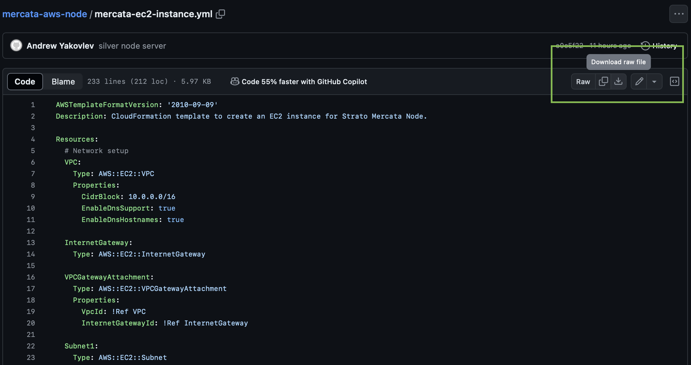
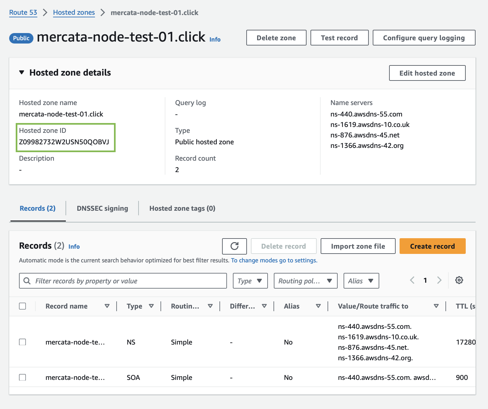
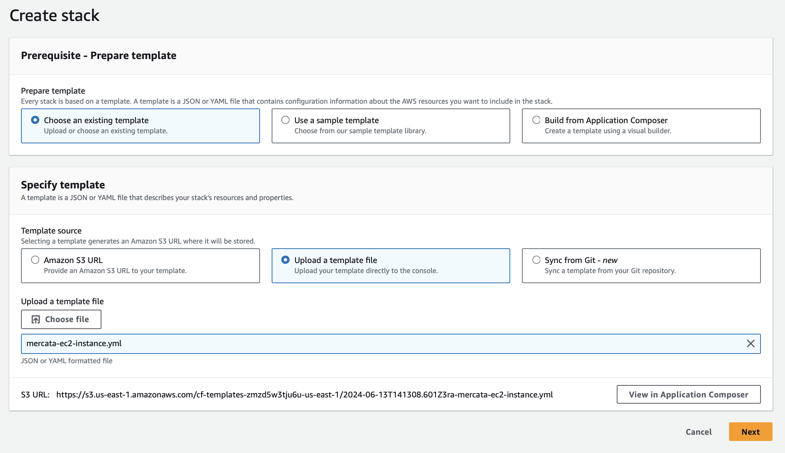
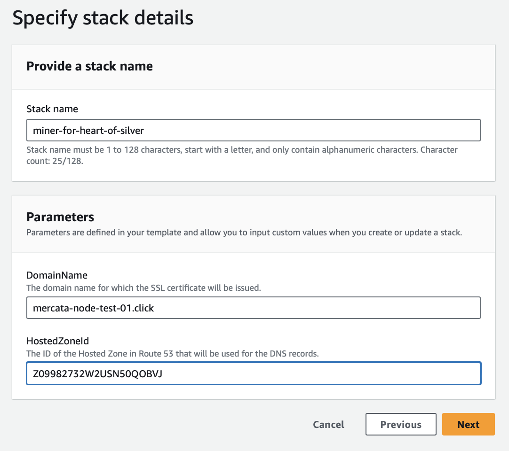
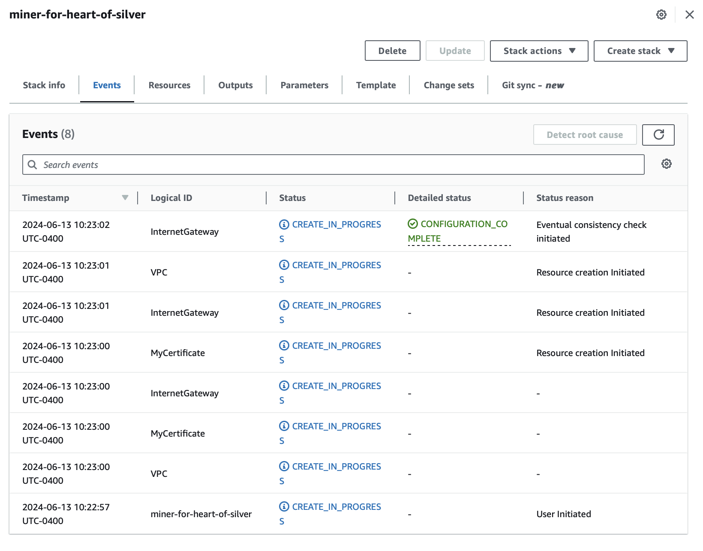
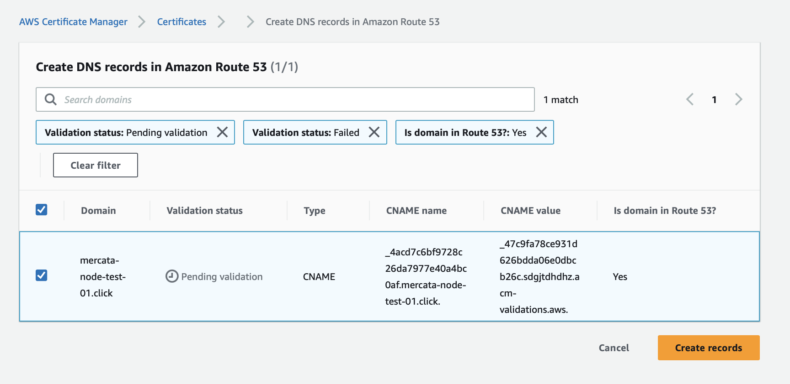
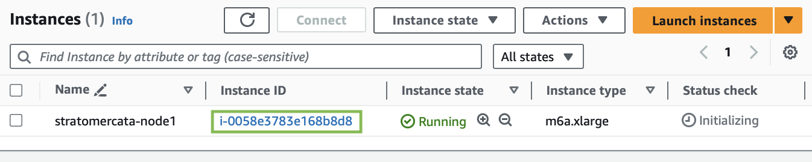
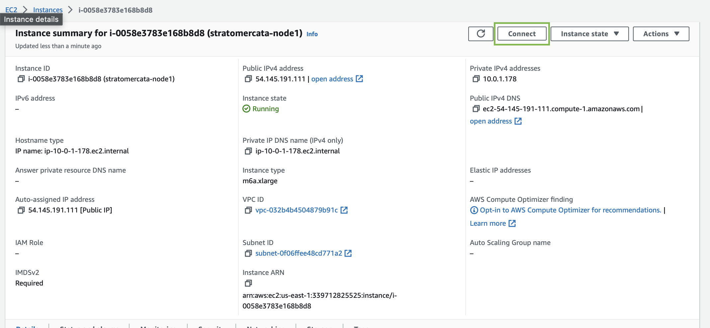
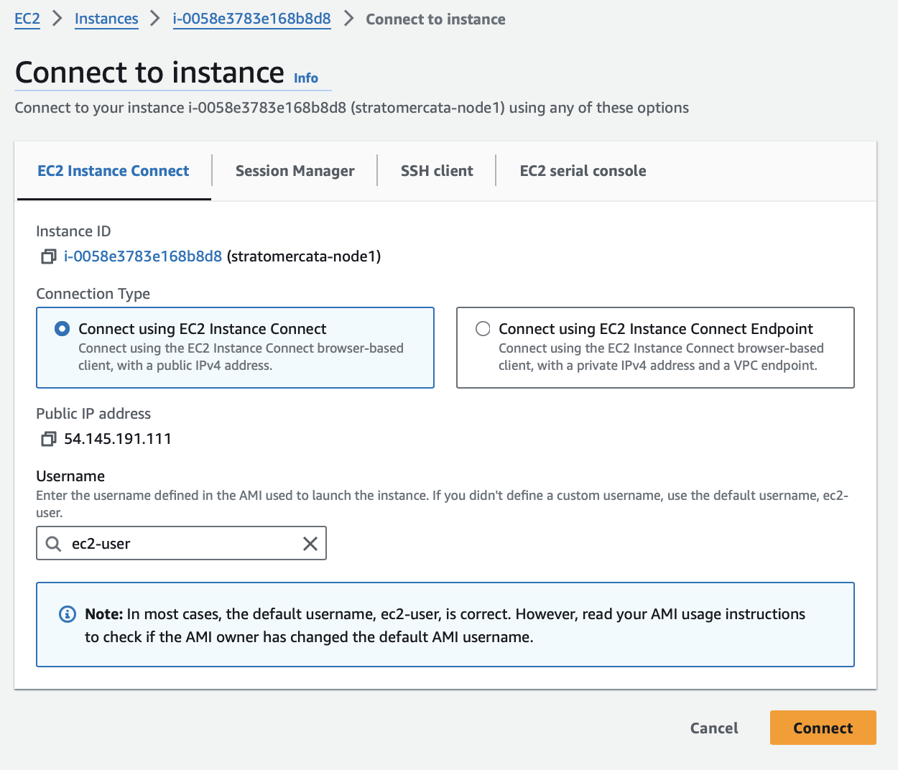
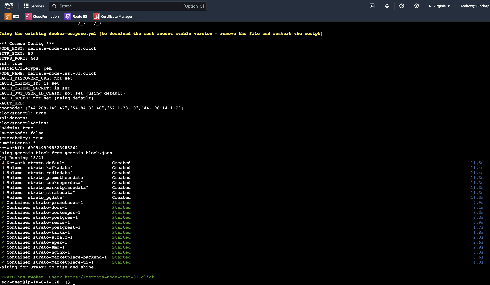

# Node Provisioning

# So you want to mine silva, Marooch?

1. Join our [**Discord**](https://discord.gg/QTWxdZaM), navigate to the [validator channel](https://discord.com/channels/1074825209175093349/1241065063452770434) and introduce yourself.
    1. You will need to provide your future node’s domain name that you set up in **Route53** in step 3.
    2. You will get two sets of credentials - `CLIENT_ID` and `CLIENT_SECRET`.
2. Create an [**AWS**](https://aws.amazon.com/) account to receive credits.
3. Visit **Route53** and register or transfer a domain name for your node.
4. Return to **Discord** and message a team member to obtain your credentials.
5. Download [EC2 Strato Node Template File](https://github.com/andyakovlev/mercata-aws-node/blob/main/mercata-ec2-instance.yml) `mercata-ec2-instance.yml` from GitHub.
    - Click **[ Download raw file ]** button.
        
        
        
6. Log back into **AWS.**
    1. **Create DNS zone for your domain if one wasn’t created automaitcally.** Go to **Route53** and click **[ Create hosted zone ].**
        - Enter your node domain name and click **[ Create hosted zone ].**
            
            
            
        - Click on the new hosted zone and expand Hosed zone details to get Hosed zone ID (save it for next step).
            
            
            
    2. **Set up your EC2.** Go to **CloudFormation** and click **[ Create stack ]**.
        - Upload `mercata-ec2-instance.yml` template from step 5 and click **[ Next ]**.
            
            
            
        - On next page, specify stack details, enter `DomainName`, and `HostedZoneId`, then click **[ Next ]**, **[ Next ]** again, and **[ Submit ]**.
            
            
            
        - Browse our **Discord** for a few mins while the deploy script does its job. Let the people know you’re about ready.
            
            
            
    3. **Set up SSL for your domain.** Go to **Certificate Manager** and click on certificate for the new domain.
        - Click **[ Create records in Route 53 ]** and then **[ Create records ]**
            
            
            
            
            
    4. **Connect to the instance to finish installation.** Go to **EC2** > Instances.
        - Click on the Instance ID of the new node.
            
            
            
        - Connect to the instance.
            
            
            
            
            
    5. **Install the node.** You’re in the terminal! 
        1. In the terminal enter command `sudo systemctl is-active docker` , if it returns `active` the **CloudFormation** script has worked and has set up the prerequisites to deploy your node! 
        2. Type `sudo bash /tmp/mercata-aws-node/strato_setup_script.sh` . Enter again your node’s `domain name`, as well as `CLIENT_ID` and `CLIENT_SECRET` you got from us.
        3. Launch link provided after the install to verify you are up and running. 
            - It should look like this:
                
                
                
7. Return to Discord and inform us that your node is running. The elders will vote you in, connecting your node to the mainnet. This will make you eligible for all the benefits and rewards of our [**Validator Program**].

**Possible Issues**

1. **SSL Certificate validation gets stuck 🕘 Pending validation**
    
    DNS changes can take time to propagate across the internet. This propagation can take anywhere from a few minutes to up to 48 hours. If the DNS records are correct but have not yet propagated, the certificate will remain in pending validation until the changes are recognized globally. Check DNS propagation status using tools like `nslookup` , `dig` , or online